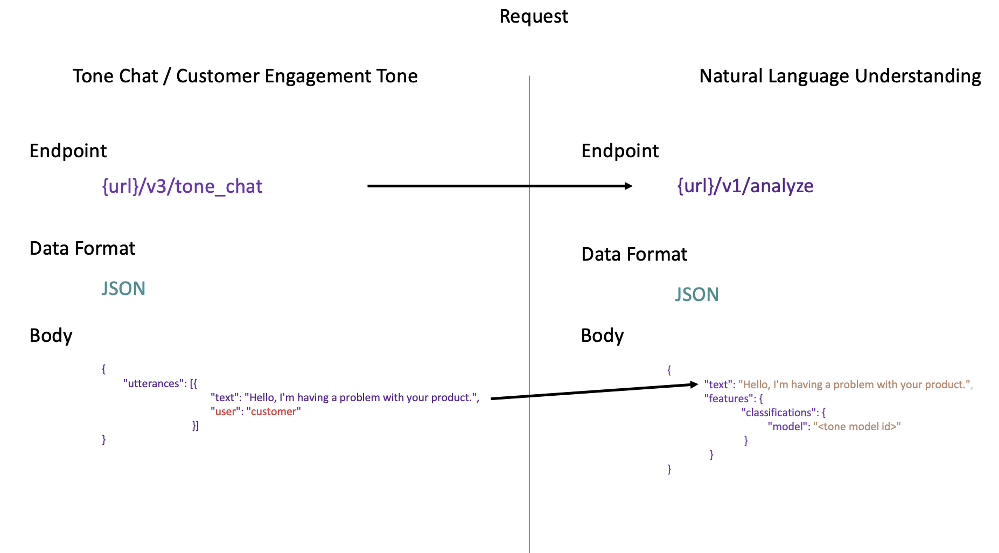

---

copyright:
  years: 2015, 2021
lastupdated: "2021-12-09"

subcollection: natural-language-understanding

---

{:shortdesc: .shortdesc}
{:external: target="_blank" .external}
{:tip: .tip}
{:note: .note}
{:beta: .beta}
{:pre: .pre}
{:important: .important}
{:codeblock: .codeblock}
{:screen: .screen}
{:javascript: .ph data-hd-programlang='javascript'}
{:java: .ph data-hd-programlang='java'}
{:python: .ph data-hd-programlang='python'}
{:swift: .ph data-hd-programlang='swift'}

# Tone analytics (Classifications)
{: #tone_analytics}

Tone analytics is currently available for English and French languages only, as indicated in the [language support](/docs/natural-language-understanding?topic=natural-language-understanding-language-support) topic.
{: important}

Tone analysis is done by using a pre-built classifications model, which provides an easy way to detect language tones in written text. It detects seven tones: `sad`, `frustrated`, `satisfied`, `excited`, `polite`, `impolite`, and `sympathetic`.

## Analyzing tone
{: #analyzing-tone}

To detect tone, use the language-specific classifications model ID in your API request.

The language-specific tone model ID is formatted as `tone-classifications-xx-v1`, where `xx` is a two-character language code. Languages available include:

| Language | Code |
| --- | --- |
| English | `en` |
| French | `fr` |

- Example *parameters.json* file:

    ```json
    {
      "language": "en",
      "text": "This is example text in English.",
      "features": {
        "classifications": {
          "model": "tone-classifications-en-v1"
        }
      }
    }
    ```

- Example cURL request:

    ```bash
    curl --request POST \
    --header "Content-Type: application/json" \
    --user "apikey":"{apikey}" \
    "{url}/v1/analyze?version=2021-08-01" \
    --data @parameters.json
    ```

### Understanding tone analytics
{: #understanding-tone-analytics}

The model returns scores for the following tones:

| Tone | Description |
| --- | --- |
| `excited` | Showing personal enthusiasm and interest |
| `frustrated` | Feeling annoyed and irritable |
| `impolite` | Being disrespectful and rude |
| `polite` | Displaying rational, goal-oriented behavior |
| `sad` | An unpleasant passive emotion |
| `satisfied` | An affective response to perceived service quality |
| `sympathetic` | An affective mode of understanding that involves emotional resonance |

- Example response:

  ```json
  {
    "usage": {
      "text_units": 1,
      "text_characters": 60,
      "features": 1
    },
    "language": "en",
    "classifications": [
      {
        "confidence": 0.564849,
        "class_name": "excited"
      },
      {
        "confidence": 0.355816,
        "class_name": "satisfied"
      },
      {
        "confidence": 0.126127,
        "class_name": "polite"
      },
      {
        "confidence": 0.026995,
        "class_name": "sympathetic"
      },
        {
        "confidence": 0.012211,
        "class_name": "frustrated"
      },
      {
        "confidence": 0.011065,
        "class_name": "sad"
      },
      {
        "confidence": 0.000872,
        "class_name": "impolite"
      }
    ]
  }
  ```

## Migrating from Watson Tone Analyzer Customer Engagement endpoint to {{site.data.keyword.nlushort}}
{: #migrating-watson-tone-analyzer}

You can migrate your [Watson Tone Analyzer customer-engagement](/docs/tone-analyzer?topic=tone-analyzer-utco) analysis requests to {{site.data.keyword.nlushort}}. This can help you better understand your interactions with customers and improve your communications generally, or for specific customers.

### Reformatting your input data

In Watson Tone Analyzer, you pass the `/v3/tone_chat` method a JSON `ToneChatInput` object consisting of `utterances`, `text`, and an optional `user` string fields. For {{site.data.keyword.nlushort}}, you pass a JSON object that contains `text` to be analyzed, and a language-specific `model` classification ID, to the `/v1/analyze` method.

.

### Understanding your response content

In Watson Tone Analyzer, the service returns a JSON `UtteranceAnalyses` object that contains a single field, `utterances_tone`, which contains an array of `UtteranceAnalysis` objects, including `score` and `tone_id`. For {{site.data.keyword.nlushort}}, a `classifications` field is returned, containing `confidence` and `class_name` objects that correspond to the Watson Tone Analyzer `score` and `tone_id` objects.

.
